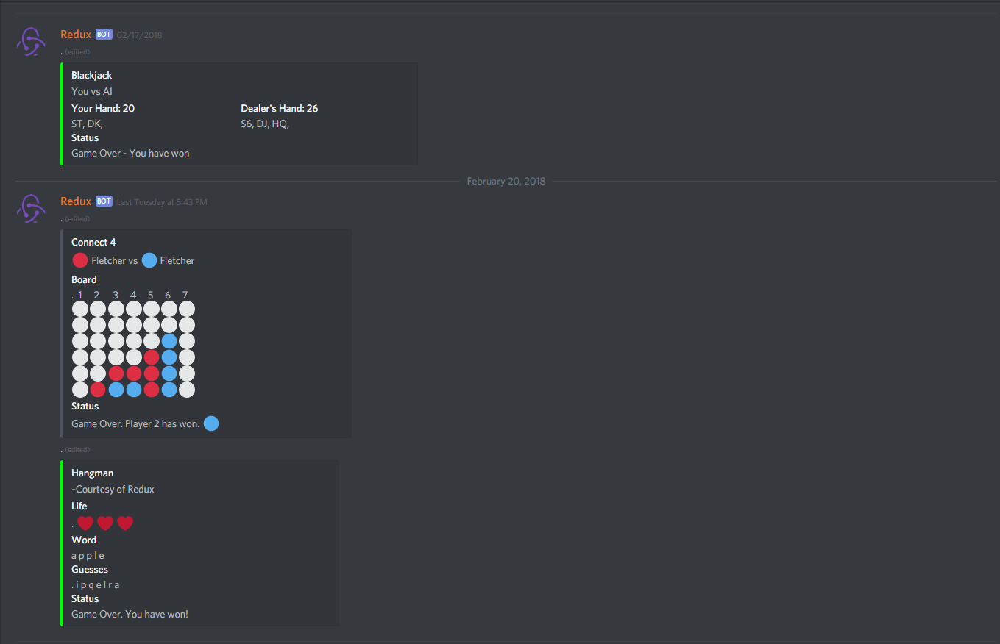

# Redux-Bot
A discord bot for a TSA competition, written in Python.

Placed 4th in the Pennsylvania State TSA competition in Software Development.

Documentation: [ReadTheDocs](https://redux-bot.readthedocs.io/en/latest/)

# Overview

Redux is a Discord bot created for the 2018 TSA Software Development competition. If you have any issues or requests, please open up an issue.

Features:
* Games such as Blackjack, Connect 4, Hangman, Spyfall, and more
* APIs - View your video game stats in League of Legends for Fortnite, as well as stock prices and the weather
* Play music or create polls to interact with the server
* Cute cat pictures from reddit :smile:

##### Commands Prefix: $

# Documentation
The documentation can be found [here](https://redux.mttsa.club) on Read The Docs.

# Planned Features
* **[x]** Updated interface using embeds
* **[x]** Connect 4
* **[x]** Reddit
* **[x]** Setup on ~~Heroku~~ Raspberry Pi
  * Run launcher.sh on startup to run the bot
* **[x]** League of Legends Stats
* **[ ]** Poker
* **[ ]** Mobile App to control settings (mute players, etc)
* **[ ]** Voice/Music autoplay
* **[ ]** Write a script to pull the newest release of this bot and restart the bot (for a Raspberry Pi ~~or Heroku~~)
* Find more things to add :)
